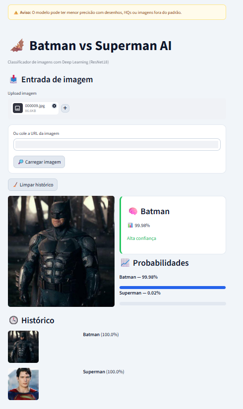

## 🔗 Acesse o projeto

👉 https://batman-superman-ai.streamlit.app/

## 📸 Preview

# 🦇 Batman vs Superman AI

Este projeto consiste em uma aplicação de Machine Learning capaz de classificar imagens entre Batman e Superman utilizando Deep Learning.

---

## 🚀 Tecnologias utilizadas

### 🧠 Google Colab — Treinamento do modelo

Utilizado para treinar o modelo de classificação de imagens com PyTorch (ResNet18), processar o dataset e gerar o arquivo final do modelo (`model.pth`).

---

### 🤗 Hugging Face — Armazenamento do modelo

Responsável por hospedar o modelo treinado e disponibilizá-lo via URL para uso na aplicação.

---

### 💻 Streamlit — Interface da aplicação

Utilizado para criar a interface web, permitindo:

* Upload de imagens
* Inserção de URL
* Predição em tempo real
* Visualização de probabilidades

---

### 🗂️ GitHub — Versionamento de código

Armazena o código do projeto e permite integração com o deploy automático.

---

### 🌐 Streamlit Cloud — Deploy

Responsável por hospedar a aplicação e disponibilizá-la online.

---

## 🔄 Fluxo do projeto

Google Colab → Treinamento
↓
Hugging Face → Armazenamento do modelo
↓
GitHub → Código da aplicação
↓
Streamlit Cloud → Deploy
↓
Usuário → Interação com o app

---

## 🎯 Resumo

O modelo foi treinado no Google Colab, armazenado no Hugging Face e integrado a uma aplicação web em Streamlit, sendo disponibilizado online via Streamlit Cloud.

---
