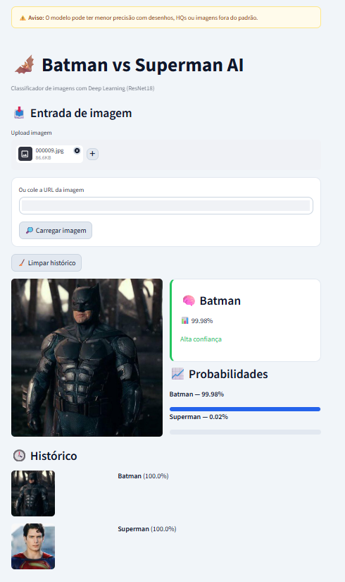

## 🔗 Access the Project

👉 https://batman-superman-ai.streamlit.app/

## 📸 Preview

# 🦇 Batman vs Superman AI

This project is a Deep Learning application for image classification between Batman and Superman using PyTorch and ResNet18, with a web interface developed in Streamlit.

---

## 🚀 Technologies Used

### 🧠 Google Colab — Model Training

Used to train the image classification model with PyTorch (ResNet18), process the dataset, and generate the final model file (`model.pth`).

---

### 🤗 Hugging Face — Model Hosting

Responsible for hosting the trained model and making it available via URL for use in the application:

https://huggingface.co/robertosulkovski/Batman_Superman_model/blob/main/model.pth

---

### 💻 Streamlit — Application Interface

Used to create the web interface, allowing:

* Image upload
* URL input
* Real-time prediction
* Probability visualization

---

### 🗂️ GitHub — Code Version Control

Stores the project source code and enables automatic deployment integration.

---

### 🌐 Streamlit Cloud — Deployment

Responsible for hosting the application and making it available online.

---

## 🧠 Model Architecture

* Architecture: ResNet18
* Framework: PyTorch
* Training Environment: Google Colab
* Model Hosting: Hugging Face
* Web Interface: Streamlit
* Deployment: Streamlit Cloud

---

## 📚 Training Notebook

The complete model training pipeline is available in:

`train_resnet18_batman_vs_superman.ipynb`

The notebook includes:

* Dataset processing
* Data loading with PyTorch
* Model training using ResNet18
* Loss function and optimizer configuration
* Model validation
* Model weight export (`model.pth`)

---

## 🔄 Project Workflow

Google Colab → Model Training  
↓  
Hugging Face → Model Hosting  
↓  
GitHub → Application Source Code  
↓  
Streamlit Cloud → Deployment  
↓  
User → Application Interaction  

---

## 🎯 Summary

The model was trained in Google Colab, hosted on Hugging Face, and integrated into a Streamlit web application, which is deployed online through Streamlit Cloud.

The complete training notebook is included in the repository to ensure reproducibility and provide transparency into the Deep Learning pipeline.

---
